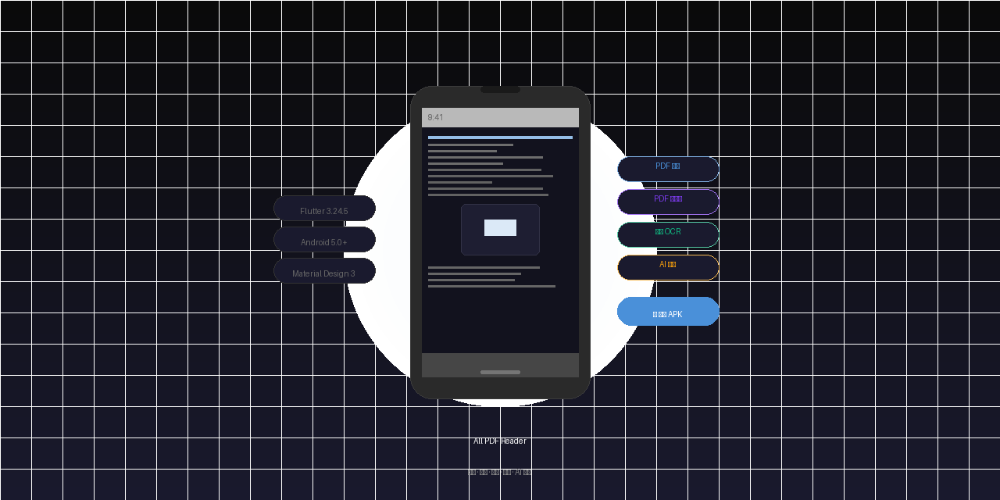

# 📱 All PDF Reader

> 高颜值暗黑风 Android PDF 阅读器 — 阅读、管理、编辑、扫描、AI 问答，一应俱全

<p align="center">
  
</p>


---
## ✨ 功能总览
### 📖 阅读体验
| 功能 | 说明 |
|------|------|
| 双指缩放 | 平滑缩放，双击切换适配宽度/适配页面 |
| 上下滚动 / 翻页 | 连续滚动模式兼容 |
| 全屏模式 | 沉浸式阅读，单击切换工具栏显隐 |
| 横屏适配 | 自动旋转，大屏体验 |
| 文本重排 (Reflow) | 原始 PDF 视图 ↔ 纯文本重排视图，字号 14-32pt 自由调节 |
| 阅读记录 | 自动保存阅读进度，重新打开恢复到上次位置 |
| 书签 | 添加、删除、列表浏览 |
| 目录/大纲 | Syncfusion 内置 PDF 书签面板，章节快速跳转 |
| 文本搜索 | PDF 全文搜索，匹配高亮 + 上下导航 |
### 📂 文件管理
- **自动扫描**：扫描手机内 7+ 个目录（Download、Documents、微信、QQ 等）
- **列表展示**：表格/列表视图，文件名、大小、日期一目了然
- **搜索排序**：按名称、大小、时间排序 + 实时搜索过滤
- **收藏**：标记常用文件，快速访问
- **最近打开**：按时间排序的阅读历史
### 🛠️ PDF 工具箱
| 工具 | 功能 |
|------|------|
| 🔗 PDF 合并 | 多文件合并为一个 PDF，支持拖拽排序 |
| ✂️ PDF 拆分 | 按页码范围拆分 / 逐页独立拆分 |
| 🖼️ PDF 转图片 | 导出为 PNG / JPG（纯 Dart 方案，零付费 API） |
| 📸 图片转 PDF | 多张图片合成 PDF，自动适配页面大小 |
| 🗑️ 删除页面 | 可视化页码网格选择，多选批量删除 |
| 🔄 旋转页面 | 90°/180°/270° 旋转，可选指定页面 |
| 📤 提取页面 | 选中页面提取为新 PDF |
| 💧 添加水印 | 自定义文字/大小/透明度/颜色，斜角水印 |
| 📦 PDF 压缩 | 移除元数据，缩小文件体积 |
### 📷 扫描 & OCR
- **拍照扫描**：调用摄像头拍摄文档
- **相册导入**：从相册选择扫描图片
- **图像增强**：自动裁剪空白 + 对比度拉伸增强
- **灰度模式**：彩色 → 灰度，提升 OCR 识别率
- **中英文 OCR**：Google ML Kit 文字识别
- **可搜索 PDF**：图片底层 + 不可见 OCR 文本层导出
### 🤖 AI PDF 助手
| 模式 | 功能 |
|------|------|
| ☁️ 云端 API | 支持 OpenAI / DeepSeek 兼容接口，PDF 总结、问答、翻译 |
| 📡 本地 LLM | 提取式摘要（词频评分）+ 关键词匹配问答，无需联网 |
| ⚙️ 灵活配置 | 供应商切换、API Key 配置、模型选择 |
### 🎨 用户体验
- **Material Design 3** — 现代设计语言
- **暗黑主题默认** — 同时支持浅色/跟随系统
- **主题切换器** — 底部弹出面板，一键切换
- **过渡动画** — 页面切换 SlideTransition + FadeTransition
- **骨架屏加载** — Shimmer 动画替代空白加载
- **空状态页面** — 友好提示 + 引导操作
- **错误状态页面** — 带重试按钮的完整错误处理
---
## 🏗️ 技术架构
### 分层架构
```
lib/
├── main.dart                     # 应用入口 + 全局状态
├── core/                         # 核心基础设施
│   ├── constants/                # 常量定义
│   ├── utils/                    # 工具函数
│   ├── extensions/               # Dart 扩展方法
│   └── widgets/                  # 通用组件 (AppLogo 等)
├── theme/                        # 主题系统
│   └── app_theme.dart            # M3 暗黑/浅色双主题
├── router/                       # 路由管理
│   └── app_router.dart           # go_router 配置
├── models/                       # 数据模型
│   └── pdf_file_info.dart        # PDF 文件信息模型
├── services/                     # 业务服务层
│   ├── pdf_scanner_service.dart   # 文件扫描
│   ├── pdf_tool_service.dart      # PDF 编辑工具
│   ├── reading_record_service.dart # 阅读记录
│   ├── bookmark_service.dart      # 书签管理
│   ├── permission_service.dart    # 权限管理 (MethodChannel)
│   ├── thumbnail_cache_service.dart # 缩略图缓存 (LRU)
│   └── ai/                        # AI 服务
│       ├── ai_factory.dart
│       ├── ai_service.dart
│       ├── cloud_ai_provider.dart
│       ├── local_ai_provider.dart
│       └── models.dart
├── providers/                    # 状态管理 (预留)
└── features/                     # 功能模块
    ├── home/                     # 首页
    ├── files/                    # 文件管理
    ├── reader/                   # PDF 阅读器
    │   ├── reader_screen.dart
    │   ├── reader_controller.dart
    │   ├── reader_reflow.dart
    │   ├── ai_assistant_page.dart
    │   └── widgets/              # 8 个拆分组件
    ├── tools/                    # PDF 工具箱 (9 个工具页)
    └── ai/                       # AI 设置
```
### 设计原则
- **模块化**：Widget 只负责 UI，业务逻辑抽离到 `services/`
- **组件化**：阅读器拆分为 8 个独立 Widget，每文件 ≤ 100 行
- **松耦合**：Router / Theme / Services 均可独立替换
- **可测试**：模型层、服务层可独立单元测试
---
## 🧰 技术栈
| 组件 | 版本 | 选型理由 |
|------|------|----------|
| **Flutter SDK** | 3.24.5 (LTS) | 稳定版，跨平台一致性，热重载开发体验 |
| **Dart** | 3.5.4 | 空安全 + 模式匹配 + 完善的异步支持 |
| **Syncfusion PDF Viewer** | 26.1.35 | 高保真 PDF 渲染，手势缩放/滚动/搜索开箱即用 |
| **Syncfusion PDF** | 26.1.35 | PDF 创建/编辑底层库（合并、拆分、水印等） |
| **go_router** | — | 声明式路由，支持深链接和动画 |
| **shared_preferences** | 2.2.3 | 轻量 KV 存储（主题、设置） |
| **path_provider** | 2.1.3 | 获取应用目录路径 |
| **file_picker** | 8.0.3 | 系统文件选择器 |
| **image_picker** | 1.0.7 | 相机/相册拍照扫描 |
| **google_mlkit_text_recognition** | 0.12.0 | 离线 OCR，中文/英文识别 |
| **image** | 4.1.7 | 纯 Dart 图像处理（PDF 转图片方案） |
| **pdf_render** | 1.4.2 | PDF 页面栅格化（替代 Syncfusion 付费 API） |
| **http** | 1.2.1 | AI API HTTP 客户端 |
| **intl** | 0.19.0 | 国际化/本地化格式化 |
| **Material Design 3** | Flutter 内置 | Google 最新设计语言 |
### 版本锁定策略
所有依赖使用 **精确版本号**（如 `26.1.35`），禁止 `^` 前缀，禁止执行 `flutter pub upgrade`，确保构建可复现。
---
## 📊 开发路线图
### 已完成 ✅
| 阶段 | 内容 | 状态 |
|------|------|------|
| Phase 0 | 项目初始化、M3 主题、CI/CD 搭建 | ✅ |
| Phase 1 | 手机 PDF 阅读 MVP（Syncfusion 渲染、手势、全屏、横屏） | ✅ |
| Phase 2 | 文件管理系统（自动扫描、搜索排序、收藏、最近打开） | ✅ |
| Phase 3 | 阅读增强（阅读记录、书签、目录、文本搜索、页码跳转） | ✅ |
| Phase 4 | UI 高级优化（动画、骨架屏、空状态、主题切换） | ✅ |
| Phase 5 | PDF 工具箱（合并、拆分、图片互转） | ✅ |
| Phase 6 | PDF 编辑功能（删除页、旋转、提取、水印、压缩） | ✅ |
| Phase 7 | 扫描/OCR（拍照、图像增强、中英文识别、可搜索 PDF） | ✅ |
| Phase 8 | AI PDF 助手（云端 API + 本地 LLM 双模式） | ✅ |
| Phase 9 | 性能优化（异步扫描、LRU 缓存、Isolate I/O） | ✅ |
### 规划中 🔜
| 阶段 | 内容 |
|------|------|
| Phase 10 | 单元测试、Widget 测试、CI 完善、v1.0.0 发布 |
---
## 🚀 未来扩展方向
### 短期（v2.x）
- **PDF 注释**：高亮、下划线、批注
- **表单填写**：PDF 表单交互
- **电子书支持**：EPUB/MOBI 格式阅读
- **云同步**：WebDAV/NextCloud 同步阅读进度和文件
### 中期（v3.x）
- **听书模式**：TTS 朗读 PDF 文本内容
- **笔记系统**：PDF 摘录 + 手写笔记
- **多标签页**：同时打开多个 PDF
- **夜间模式**：深色滤镜 + 亮度调节
### 长期（v4.x+）
- **插件系统**：支持第三方扩展
- **桌面版**：Flutter 跨平台扩展到 Windows/macOS
- **协作功能**：共享批注和评论
- **AI 深度集成**：文档对比、自动摘要、知识图谱
---
## 🔧 构建指南
### 环境要求
| 工具 | 版本 |
|------|------|
| Flutter SDK | 3.24.5 |
| Dart | 3.5.4 |
| Java | 17+ |
| Android SDK | API 34 (targetSdk) |
| Android minSdk | 21 |
### 构建步骤
```bash
# 1. 克隆仓库
git clone https://github.com/malaxiya2019/PdfReader.git
cd PdfReader/flutter_pdf_reader
# 2. 获取依赖
flutter pub get
# 3. 静态分析
flutter analyze
# 4. Debug APK
flutter build apk --debug
# 5. Release APK
flutter build apk --release
# 6. App Bundle（发布 Google Play）
flutter build appbundle --release
```
### CI/CD
GitHub Actions 自动执行：
1. `flutter pub get`
2. `flutter analyze`
3. `flutter test`
4. `flutter build apk --debug`
5. 产物上传为 Artifact
6. 推送 tag 自动构建 Release APK + AAB + GitHub Release
---
## 📁 项目文件结构
```
PdfReader/
├── README.md                          # 本文件
├── CHANGELOG.md                       # 变更日志
├── AGENTS.md                          # AI 代理配置
├── CODEX_SYSTEM_PROMPT.md             # 开发系统提示词
├── docs/
│   └── DEVELOPMENT_PLAN.md            # 开发计划书
├── .github/workflows/
│   └── flutter-build.yml              # CI/CD 工作流
└── flutter_pdf_reader/                # Flutter 项目根目录
    ├── pubspec.yaml                   # 依赖声明（精确版本）
    ├── pubspec.lock.bak               # 锁定文件备份
    ├── RELEASE_NOTES.md               # 发布说明
    ├── analysis_options.yaml          # Lint 配置
    ├── android/                       # Android 原生配置
    ├── assets/                        # 静态资源
    │   └── logo.svg
    ├── lib/                           # Dart 源码
    ├── test/                          # 单元测试
    │   ├── models/
    │   └── services/
    └── build/                         # 构建产物（gitignore）
```
---
## ⚡ 性能基准
| 场景 | 指标 |
|------|------|
| 10MB PDF 打开 | < 1 秒 |
| 100MB PDF 打开 | < 3 秒 |
| 500MB PDF 打开 | 不闪退，可阅读 |
| 文件扫描（1000+ 文件） | < 3 秒（缓存后） |
| 缩略图生成 | LRU 磁盘缓存，50MB 上限 |
---
## 🤝 贡献指南
1. Fork 本仓库
2. 创建特性分支 (`git checkout -b feature/amazing-feature`)
3. 提交代码 (`git commit -m 'feat: 添加某个功能'`)
4. 推送到分支 (`git push origin feature/amazing-feature`)
5. 提交 Pull Request
### Commit 规范
```
feat:    新功能
fix:     修复 bug
refactor: 重构
style:   代码格式
docs:    文档
chore:   构建/CI
test:    测试
```
---
## 📄 License
MIT License
Copyright (c) 2026 [Liang2050 / malaxiya2019]
---
## 📬 联系
- GitHub: [malaxiya2019/PdfReader](https://github.com/malaxiya2019/PdfReader)
- Gitee: [liang2050/PdfReader](https://gitee.com/liang2050/PdfReader)
---
> **All PDF Reader** — 不只是阅读器，是你的全能 PDF 伴侣
